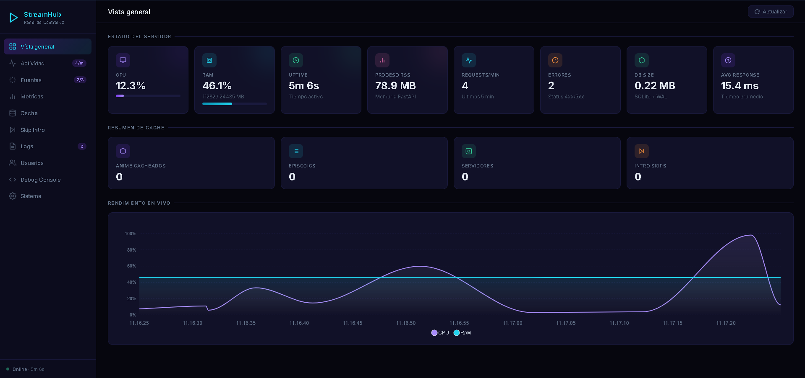
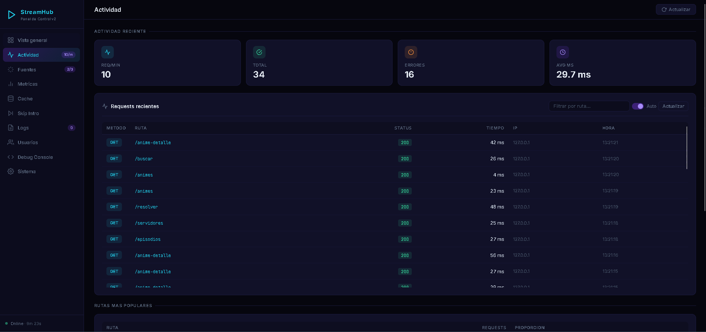
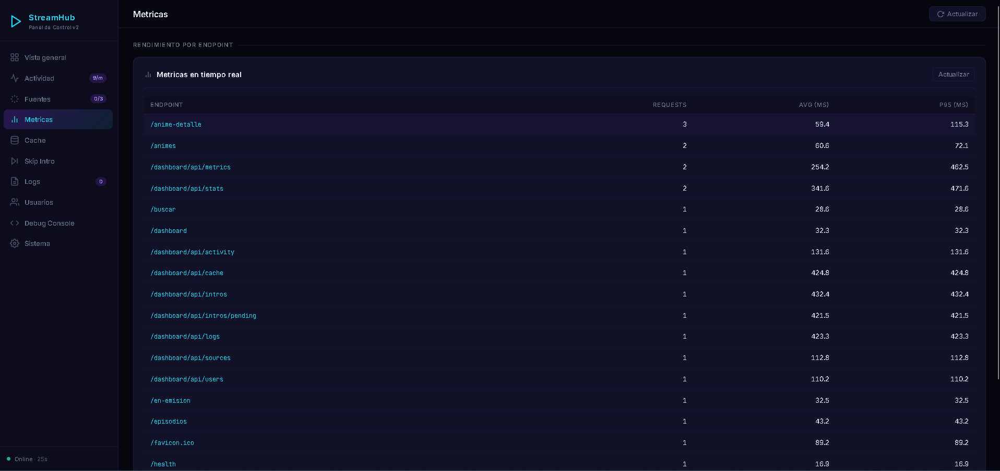
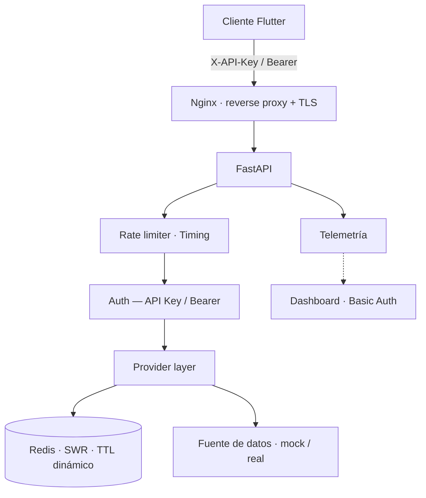

<div align="center">

# StreamHub Demo

*Plataforma de streaming full-stack construida como portfolio técnico. Combina una API REST con FastAPI, caché en dos capas con Redis, autenticación completa, dashboard de telemetría propio y un cliente móvil nativo en Flutter.*


</div>

---

## Vista previa

**Vista general** — métricas del servidor en tiempo real: CPU, RAM, uptime y rendimiento.


**Actividad** — registro de cada petición con método, ruta, status, tiempo de respuesta e IP.


**Métricas por endpoint** — requests totales, tiempo promedio y percentil 95 por ruta.


---

## ¿Qué demuestra este proyecto?

StreamHub es la versión pública de un sistema de streaming personal diseñado para practicar e integrar múltiples áreas del desarrollo de software en un mismo proyecto cohesionado:

| Área | Patrones y tecnologías |
|---|---|
| API REST | FastAPI, Uvicorn, routing modular, validación de parámetros |
| Caché | Redis con TTL dinámico + Stale-While-Revalidate (SWR) |
| Seguridad | API Key, Bearer tokens, rate limiting sliding-window |
| Infraestructura | Docker Compose, Nginx reverse proxy, systemd, HTTPS/Certbot |
| App móvil | Flutter, Riverpod, reproductor nativo, persistencia offline |
| Observabilidad | Dashboard propio con métricas, actividad y health checks |
| Diseño | Patrón Provider para desacoplar rutas de la fuente de datos |

---

## Stack

<table>
<tr>
<td valign="top" width="50%">

**Backend**

| Capa | Tecnología |
|---|---|
| API | FastAPI + Uvicorn |
| Caché distribuida | Redis 7 |
| Caché en memoria | TTLCache (por worker) |
| Persistencia | SQLite |
| Autenticación | API Key + sesiones Bearer |
| Rate limiting | SQLite sliding-window |
| Tareas programadas | APScheduler |
| Monitoreo | Dashboard HTML/JS + Basic Auth |
| Despliegue | Docker Compose + Nginx + Certbot |

</td>
<td valign="top" width="50%">

**App móvil**

| Capa | Tecnología |
|---|---|
| Framework | Flutter (Android) |
| Estado | Riverpod |
| Reproductor | media_kit |
| Persistencia local | Drift / SQLite |
| Sincronización | User state API (Bearer) |

</td>
</tr>
</table>

---

## Arquitectura



**Infraestructura destacada:**

- **Nginx como TLS terminator** — FastAPI nunca toca SSL; Nginx reenvía `X-Real-IP` para que el rate limiter vea la IP del cliente, no la del proxy.
- **SQLite en modo WAL** — permite lecturas concurrentes sin bloquear escrituras, necesario con múltiples workers de Uvicorn.
- **SQLite con múltiples roles** — rate limiting (sliding-window), autenticación (usuarios + sesiones Bearer), sincronización de estado del usuario y telemetría durable.
- **APScheduler en background** — precalienta la caché al arrancar y lanza refresco periódico de datos; en producción aloja las tareas de actualización del catálogo sin bloquear el event loop de FastAPI.

**Patrones de caché destacados:**

- **Stale-While-Revalidate (SWR)** — los datos se sirven inmediatamente desde caché y se revalidan en background cuando superan el 75% de su TTL.
- **TTL dinámico** — el TTL se reduce automáticamente para entradas que cambian con frecuencia, aumentando la frescura sin coste adicional.
- **Caché en dos capas** — Redis comparte datos entre workers; TTLCache en memoria evita round-trips a Redis para los accesos más frecuentes.
- **Offline-first en Flutter** — las listas principales se persisten localmente con Drift; la app es funcional sin conexión y sincroniza al recuperarla.

---

## Estructura del proyecto

```
streamhub-demo/
├── backend/
│   ├── providers/        # Abstracción de fuente de datos (mock / real)
│   ├── routes/           # Endpoints REST organizados por dominio
│   ├── db/               # Redis, SQLite, métricas y caché service
│   ├── dashboard/        # Panel de telemetría (HTML + JS + Basic Auth)
│   ├── utils/            # Buffer de logs y registro de actividad
│   └── tests/            # Tests de integración (pytest)
├── frontend_flutter/     # Cliente Android (Flutter)
├── nginx/                # Configuración reverse proxy + HTTPS
├── deploy/               # Script de setup para VPS + systemd service
└── docker-compose.yml
```

---

## Inicio rápido

### Con Docker Compose

```bash
cp backend/.env.example backend/.env
# Edita backend/.env con tus valores

docker compose up -d

# Verificar que arranca
curl http://localhost:5050/health
```

### Backend en local

```bash
cd backend
python -m venv venv
source venv/bin/activate        # Windows: venv\Scripts\activate
pip install -r requirements.txt

cp .env.example .env
# Edita .env con tus valores

python app.py
```

Backend disponible en `http://localhost:5050`. El dashboard de monitoreo en `http://localhost:5050/dashboard`.

### App Flutter

```bash
cd frontend_flutter
flutter pub get

# Emulador Android
flutter run \
  --dart-define=API_BASE_URL=http://10.0.2.2:5050 \
  --dart-define=API_KEY=tu_api_key

# Dispositivo físico en la misma red
flutter run \
  --dart-define=API_BASE_URL=http://192.168.1.X:5050 \
  --dart-define=API_KEY=tu_api_key
```

---

## Variables de entorno

```bash
cp backend/.env.example backend/.env
```

```env
API_KEY=reemplaza_con_valor_aleatorio_largo
DASHBOARD_USER=reemplaza_con_usuario
DASHBOARD_PASS=reemplaza_con_contraseña_larga
ALLOWED_ORIGINS=http://localhost:3000
DATA_PROVIDER=mock
```

---

## Endpoints principales

**Sin autenticación**

| Método | Ruta | Descripción |
|---|---|---|
| `GET` | `/health` | Estado del servicio y Redis |
| `GET` | `/metrics` | Métricas de latencia por ruta |
| `GET` | `/dashboard` | Panel de monitoreo (Basic Auth) |

**API Key** — header `X-API-Key`

| Método | Ruta | Descripción |
|---|---|---|
| `GET` | `/animes` | Catálogo de contenido |
| `GET` | `/ultimos-episodios` | Episodios recientes |
| `GET` | `/en-emision` | Contenido en emisión |
| `GET` | `/buscar?q=` | Búsqueda en el catálogo |
| `GET` | `/anime-detalle?url=` | Detalle de título |
| `GET` | `/episodios?url=` | Lista de episodios |
| `GET` | `/servidores?url=` | Fuentes de vídeo disponibles |
| `GET` | `/resolver?url=` | Resolución a URL de reproducción |
| `POST` | `/auth/register` | Registro de usuario |
| `POST` | `/auth/login` | Inicio de sesión |

**Bearer token** — header `Authorization: Bearer <token>`

| Método | Ruta | Descripción |
|---|---|---|
| `GET` | `/auth/me` | Perfil del usuario autenticado |
| `GET` | `/user/state` | Descargar estado del usuario |
| `POST` | `/user/state` | Sincronizar estado del usuario |

---

## Modo demo

La versión pública funciona con `DATA_PROVIDER=mock`. Todos los datos son ficticios (títulos inventados, imágenes de dominio público). Redis no es necesario en este modo — el backend arranca sin él y opera en degradado (métricas en memoria). El endpoint `/resolver` apunta a un vídeo de Google con licencia Creative Commons, usado únicamente para validar el flujo completo:

- Reproducción nativa en el player
- Progreso y "continuar viendo"
- Sincronización de estado entre sesiones
- Registro de telemetría y dashboard de monitoreo

---

## Despliegue en VPS

El directorio `deploy/` incluye un script de setup para Ubuntu/Debian, un service de systemd y una configuración de Nginx para despliegue directo (sin Docker), que hace proxy a `127.0.0.1:5050`.

El directorio `nginx/` contiene la configuración para el stack Docker Compose, con TLS termination vía Certbot y proxy al servicio interno `backend:5050`.

```bash
# En el servidor (como root)
bash deploy/setup.sh
```

---

## Contribuir

Consulta [CONTRIBUTING.md](./CONTRIBUTING.md) para instrucciones de setup, cómo ejecutar los tests y las convenciones del proyecto.

El backend incluye una suite de integración que cubre los endpoints principales y el flujo de autenticación completo. Los tests no requieren Redis ni variables de entorno configuradas; el CI los ejecuta automáticamente en cada push.

---

## Aviso legal

Este repositorio se publica únicamente como demo técnica y educativa. No aloja, almacena, distribuye, vende ni monetiza contenido audiovisual. No está pensado como plataforma pública de streaming ni como producto comercial.

Consulta [DISCLAIMER.md](./DISCLAIMER.md) para más detalle.
